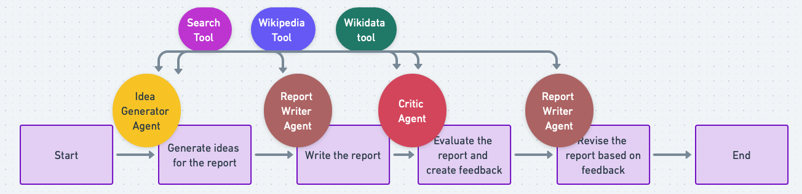

# AI Crew for helping students with Assignments
## Introduction
This project is an example using the CrewAI framework to automate the process of creating assignments. CrewAI orchestrates autonomous AI agents, enabling them to collaborate and execute complex tasks efficiently.

#### Assignment Crew
The full details are explained in my blog post [here](https://medium.com/p/b377d4f5e6b8/edit)

## Running the Script
This example uses GPT-4.
- **Configure Environment**: Add your OpenAI Key to the  ``.env` and set up any other environment variable you need
- **Execute the Script**: Run `python main.py` and input your idea.

## Details & Explanation
- **Running the Script**: Execute `python main.py`` and input your idea when prompted. The script will leverage the CrewAI framework to process the idea and generate a landing page.
- **Key Components**:
  - `./main.py`: Main script file.
  - `./tasks.py`: Main file with the tasks prompts.
  - `./agents.py`: Main file with the agents creation.

## License
This project is released under the MIT License.
