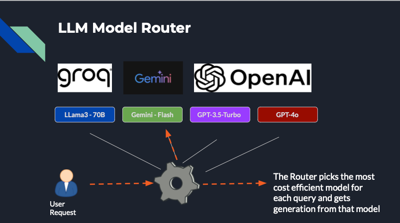

# LLM Model Router 🤖🔀🧠



This Streamlit-powered LLM router seamlessly routes requests between four powerful language models:

* Groq's LLaMA3-70B-8192 🦖
* Gemini's Gemini-1.5-Flash 🚀
* OpenAI's GPT-3.5-Turbo 💬
* OpenAI's GPT-4o ✨

## Features 🚀

* **Streamlit UI:** Intuitive interface for interacting with the router.
* **Intelligent Routing:**  Powered by the `routeLLM` library from LMSYS, requests are dynamically sent to the most suitable model based on Matrix Factorization router

This works extends the original `routeLLM` by adding comparison between multiple models instead of 2

## Installation 🛠️

1. **Clone the Repository:**
   ```bash
   git clone https://github.com/priya-dwivedi/generative-ai
   cd router-llm
    ```
2. **Install dependencies:**
   ```bash
   pip install "routellm[serve,eval]"
   pip install streamlit python-dotenv
    ```
3. **Add your keys to .env file:**
   Rename .env_sample to .env
   Add your keys to this file

4. **Start the Streamlit server:**
   ```bash
   streamlit run router_chatbot.py
    ```

Note: The current router has a cost threshold set so that 50% of the requests go to the stronger, more expensive model

## Sources
Based on LMSYS RouteLLM - https://github.com/lm-sys/RouteLLM